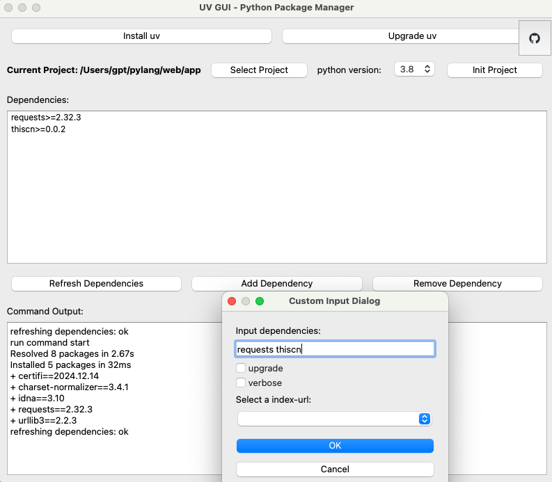

# UV-GUI

uv gui to manage python packages

## First click star

## install

```sh
uv sync
```

## Usage

```sh
uv run main.py
```

## Manage

```
1. select project
2. init project

add dependencies
remove dependency
```

